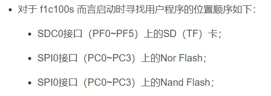
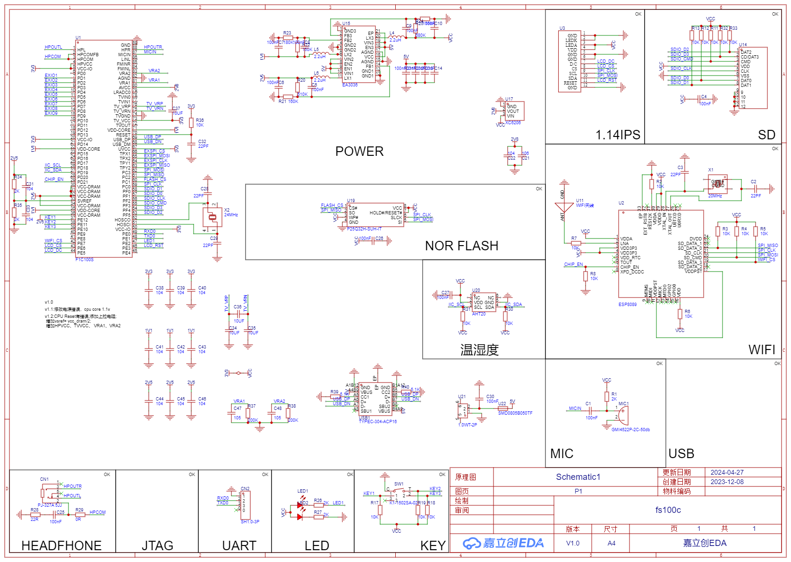

- [ 0.说明](#head1)
	- [ 芯片介绍](#head2)
	- [ 开发工具](#head3)


## <span id="head1"> 0.说明</span>

> 本项目是一个基于全志F1C100s芯片的超迷你&低成本的Linux开发板.
>
> **板载资源：**
>
> * 一个SPI-LCD
> * 一个麦克风 & 功放可以外接喇叭
> * 一个板载麦克风
> * 一个USB-Type-C
> * SD卡插槽
> * 一个IIC温湿度
> * 一个SPI-flsah
> * WIFI(基于ESP8089 SPI)
>

### <span id="head2"> 芯片介绍</span>

> 全志F1C100s&F1C200s是全志的一款高度集成、低功耗的移动应用处理器，可用于多种多媒体音视频设备中。

`F1C200s`基于ARM 9架构，芯片集成了SiP的DDR，外围电路可以极其简单；它支持高清视频解码，包括H.264、H.263、MPEG 1/2/4等，还集成了音频编解码器和I2S/PCM接口，是一款开发简单、性价比较高的产品，也适合用来做入门级的Linux开发板。

---

| 功能         | 描述                                                         |
| ------------ | ------------------------------------------------------------ |
| CPU          | ARM9 CPU architecture，16KByte D-Cache，2KByte I-Cache       |
| Memory       | SIP 64MB DDR1，SD2.0，eMMC 4.41                              |
| Video        | H.264 1920x1080@30fps decoding<br/>MPEG1/2/4 1920x1080@30fps decoding<br/>MJPEG 1280x720@30fps encoding<br/>JPEG encode size up to 8192x8192 |
| Camera       | 8-bit CMOS-sensor interface<br/>CCIR656 protocol for NTSC and PAL |
| Audio        | Integrated analog audio codec with two DAC channels and one ADC channel,maximum 192kHz DAC sample rate and 48kHz ADC sample rate<br/>One I2S/PCM interface |
| Display      | LCD RGB interface up to 1280x720@60fps<br/>TV CVBS output, support NTSC/PAL, with auto plug detecting |
| Connectivity | USB OTG, SDIO,IR, 3 x TWI, 2 x SPI, 3 x UART                 |
| OS           | Melis, Linux OS                                              |
| Package      | QFN88, 10mm x 10mm                                           |
| Process      | 40nm                                                         |
| 特点         | 支持H.264 1920x1080@30fps 解码<br/>支持MJPEG 1280x720@30fps 编码<br/>集成 64MB DDR1,集成音频CODEC<br/>低成本，低功耗，开发简单 |

**与其他系列芯片的对比：**


### <span id="head3"> 开发工具</span>
**芯片启动流程**

#### <span id="head4">1. 开发工具链下载</span>

```bash
wget http://releases.linaro.org/components/toolchain/binaries/7.2-2017.11/arm-linux-gnueabi/gcc-linaro-7.2.1-2017.11-x86_64_arm-linux-gnueabi.tar.xz
```
#### <span id="head5">2. sunxi-tools</span>

```bash
git clone -b f1c100s-spiflash https://github.com/Icenowy/sunxi-tools.git
cd sunxi-tools
make && sudo make install
```
[编译和使用sunxi-tools](https://wiki.sipeed.com/soft/Lichee/zh/Nano-Doc-Backup/step_by_step/two_sunxi-tools.html)

#### <span id="head6">3. u-boot</span>

```bash
git clone https://gitee.com/LicheePiNano/u-boot.git -b nano-lcd800480
make ARCH=arm CROSS_COMPILE=arm-linux-gnueabi- licheepi_nano_spiflash_defconfig
```

#### <span id="head7">4. kernel</span>

```bash
git clone https://gitee.com/LicheePiNano/Linux.git 
make ARCH=arm CROSS_COMPILE=arm-linux-gnueabi- f1c100s_nano_linux_defconfig
```

#### <span id="head8">5. buildroot</span>

```bash
wget https://buildroot.org/downloads/buildroot-2021.02.4.tar.gz
make ARCH=arm CROSS_COMPILE=arm-linux-gnueabi-
```

## <span id="head9"> 1.硬件开发</span>
### <span id="head10"> 原理图</span>

### <span id="head11"> 引脚分配</span>
|Pin ID |Pin name |Function                                           |
| ---- | ----------|-------------------------------------------------- |
|Pin29  | PD21       | WIFI_CHIP_EN|
|Pin42  | PE7       | SPI0_WIFI_CS|
|Pin53  | PF5       | SDC0_D2|
|Pin54  | PF4       | SDC0_D3|
|Pin55  | PF3       | SDC0_CMD|
|Pin56  | PF2       | SDC0_CLK|
|Pin57  | PF1       | SDC0_D0|
|Pin58  | PF0       | SDC0_D1|
|Pin59 | PC0 | SPI0_CLK|
|Pin60 | PC1 | SPI0_FLASH_CS|
|Pin61 | PC2 | SPI0_MISO|
|Pin62 | PC3 | SPI0_MOSI|

## <span id="head9"> 2.软件开发</span>
### <span id="head10"> 编译uboot</span>

```bash
make ARCH=arm CROSS_COMPILE=arm-linux-gnueabi- f1c100s_xiaodq_spiflash_defconfig
make ARCH=arm CROSS_COMPILE=arm-linux-gnueabi- 
```
### <span id="head10"> 编译kernel</span>

```bash
make ARCH=arm CROSS_COMPILE=arm-linux-gnueabi- f1c100s_xiaodq_linux_defconfig
make ARCH=arm CROSS_COMPILE=arm-linux-gnueabi- 
make ARCH=arm CROSS_COMPILE=arm-linux-gnueabi- INSTALL_MOD_PATH=out modules
make ARCH=arm CROSS_COMPILE=arm-linux-gnueabi- INSTALL_MOD_PATH=out modules_install
```

### 其他参考资料

* [peng-zhihui/Planck-Pi](https://github.com/peng-zhihui/Planck-Pi)
* [全志F1C100s使用记录：资料索引与基础说明](https://blog.csdn.net/Naisu_kun/article/details/122704052)
* [荔枝派Nano 全流程指南](https://wiki.sipeed.com/soft/Lichee/zh/Nano-Doc-Backup/index.html)
